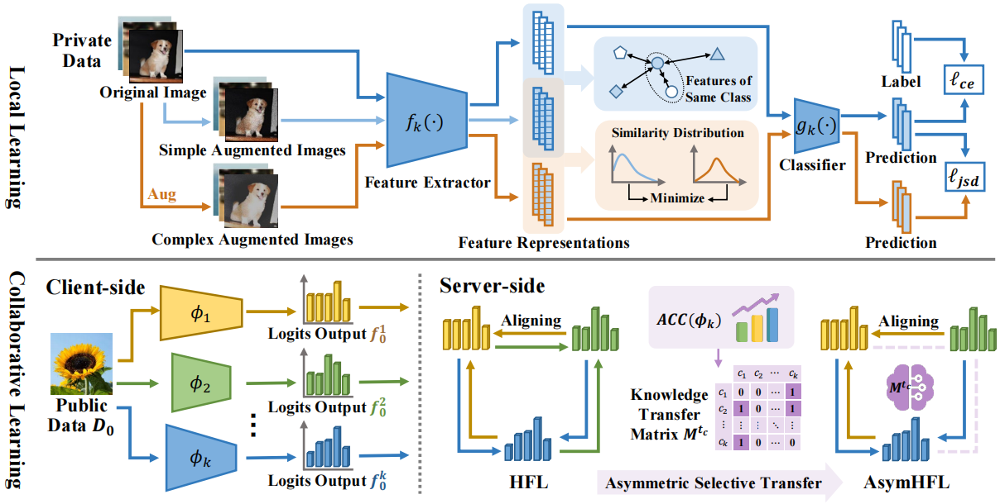
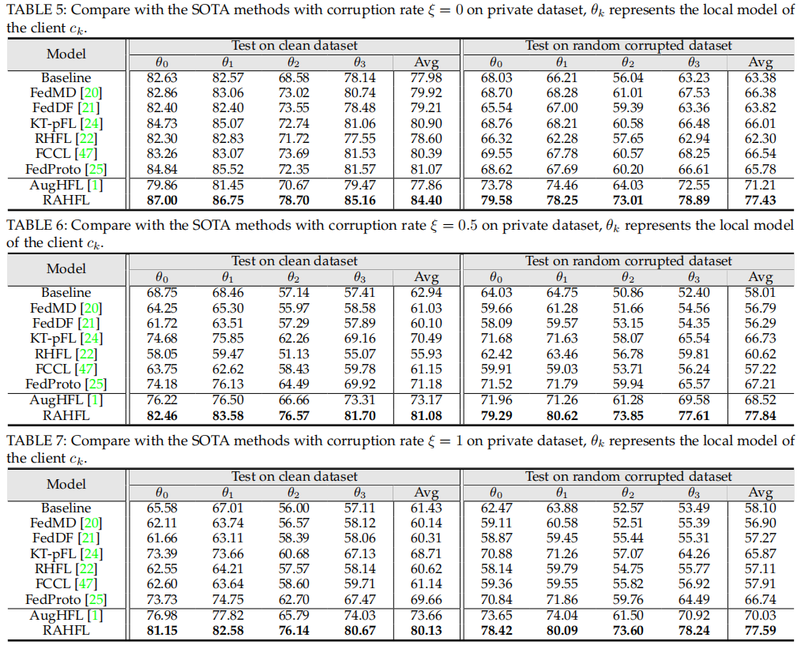

# RAHFL

This repository provides resources for the following paper:

> [**Robust Asymmetric Heterogeneous Federated Learning With Corrupted Clients**](https://ieeexplore.ieee.org/abstract/document/10833756)
> 
> Xiuwen Fang, [Mang Ye](https://marswhu.github.io/index.html), Bo Du *IEEE TPAMI 2025*

It is an extended version of the following paper:

> [**Robust Heterogeneous Federated Learning under Data Corruption**](https://openaccess.thecvf.com/content/ICCV2023/html/Fang_Robust_Heterogeneous_Federated_Learning_under_Data_Corruption_ICCV_2023_paper.html)
> 
> Xiuwen Fang, [Mang Ye](https://marswhu.github.io/index.html), Xiyuan Yang *ICCV 2023*

# [RAHFL Description](#contents)

RAHFL(Robust Asymmetric Heterogeneous Federated Learning) is a federated learning framework to investigate the problem of data corruption in the model heterogeneous federated learning:

1. Robust Local Learning with Data Corruption.

2. Asymmetric Heterogeneous Federated Learning.

# [Framework Architecture](#contents)



# [Dataset](#contents)

Our experiments are conducted on two datasets, Cifar-10-C and Cifar-100. We set public dataset on the server as a subset of Cifar-100, and randomly divide Cifar-10-C to different clients as private datasets.

Dataset used: [CIFAR-10-C](https://zenodo.org/records/2535967)、[CIFAR-100](http://www.cs.toronto.edu/~kriz/cifar.html)

Note: Cifar-10-C can be genearetd by make_cifar_c.py. Data will be processed in init_data.py.

# [Quick Start](#contents)

You can start training and evaluation as follows:

```bash
# Dependencies installation
conda create -n rahfl python=3.8.5
conda activate rahfl
git clone https://github.com/FangXiuwen/RAHFL.git
cd RAHFL
pip install -r requirements.txt

# Download the cifar10 and cifar100 datasets to cifar_10 and cifar_100 folders in Dataset
# init public data and local data
cd Dataset
python make_cifar_c.py
# pretrain local models
cd Network
python pretrain.py
# RAHFL
cd HHF
python RAHFL.py
```

# [Script and Sample Code](#contents)

```bash
├── Robust_FL
    ├── Dataset
        ├── __init__.py
        ├── augmentations.py
        ├── cifar.py
        ├── dataaug.py
        ├── init_dataset.py
        ├── make_cifar_c.py
        ├── sampling.py
        ├── utils.py
    ├── Network
        ├── Models_Def
            ├── mobilnet_v2.py
            ├── resnet.py
            ├── shufflenet.py
        ├── __init__.py
        ├── pretrain.py
    ├── HHF
        ├── RAHFL.py
    ├── loss.py
    ├── README.md
    ├── requirements.txt
```

# [Comparison with the SOTA methods](#contents)

In the heterogeneous model scenario, we assign four different networks:ResNet10,ResNet12,ShuffleNet,Mobilenetv2



# [Citation](#contents)

```citation
@article{tpami2025rahfl,
  title={Robust Asymmetric Heterogeneous Federated Learning with Corrupted Clients},
  author={Fang, Xiuwen and Ye, Mang and Du, Bo},
  journal={IEEE Transactions on Pattern Analysis and Machine Intelligence},
  year={2025},
  publisher={IEEE}
}
```
